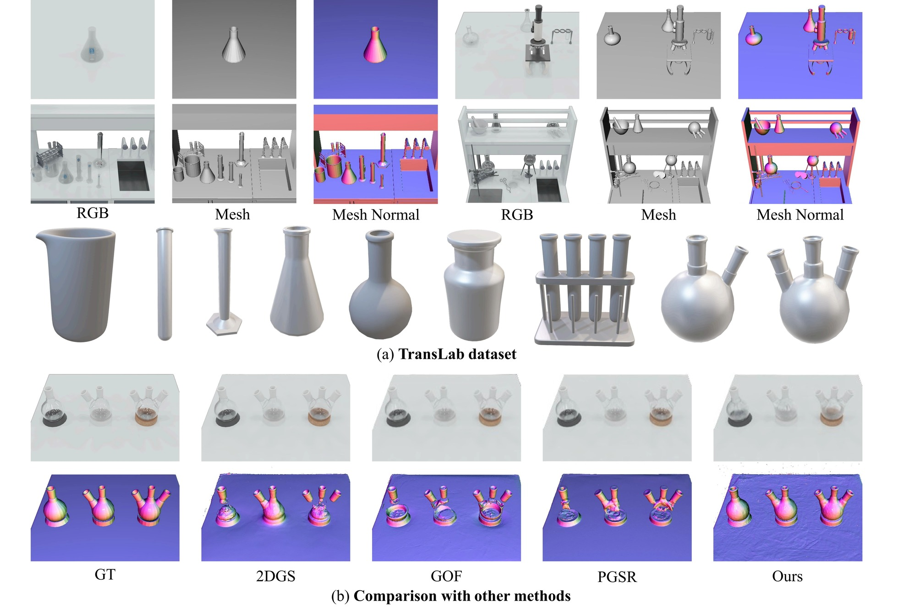
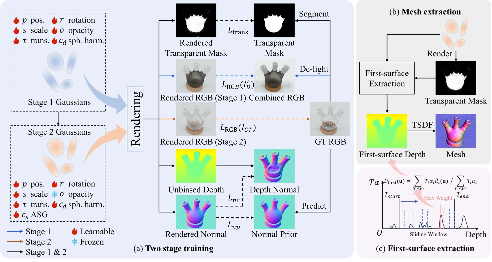

# TSGS: Improving Gaussian Splatting for Transparent Surface Reconstruction via Normal and De-lighting Priors

[](https://arxiv.org/abs/2504.12799)
[](https://longxiang-ai.github.io/TSGS/)
[](https://github.com/longxiang-ai/TSGS)
[](https://drive.google.com/file/d/1ATRQdFaxo2XfcBWkk-Etu5IC9CQxeoyU/view?usp=sharing)

Official code release for the paper: **TSGS: Improving Gaussian Splatting for Transparent Surface Reconstruction via Normal and De-lighting Priors**.

[Mingwei Li<sup>1,2</sup>](https://github.com/longxiang-ai), [Pu Pang<sup>3,2</sup>](https://github.com/fankewen), [Hehe Fan<sup>1</sup>](https://hehefan.github.io/), [Hua Huang<sup>4</sup>](https://ai.bnu.edu.cn/xygk/szdw/zgj/194482e0996d4044806ac39019896e9c.htm), [Yi Yang<sup>1,&#9993;</sup>](https://scholar.google.com/citations?user=RMSuNFwAAAAJ&hl=en)

*<sup>1</sup>Zhejiang University, <sup>2</sup>Zhongguancun Academy, Beijing, <sup>3</sup>Xi'an Jiaotong University, <sup>4</sup>Beijing Normal University*

## News

* **[2025-07-13]**: 🎉 Our code and dataset are released!
* **[2025-07-05]**: 🏆 Our paper has been accepted by ACM MM 2025!
* **[2025-04-18]**: 🎉 Our arXiv paper is released! You can find it [here](https://arxiv.org/abs/2504.12799). Project page is also live!


*We present TSGS, a framework for high-fidelity transparent surface reconstruction from multi-views. (a) We introduce TransLab, a novel dataset for evaluating transparent object reconstruction. (b) Comparative results on TransLab demonstrate the superior capability of TSGS.*

## Method Overview


*(a) The two-stage training process. Stage 1 optimizes 3D Gaussians using geometric priors and de-lighted inputs. Stage 2 refines appearance while fixing opacity. (b) Inference extracts the first-surface depth map for mesh reconstruction. (c) The first-surface depth extraction module uses a sliding window for robust depth calculation.*

## Installation

1. **Clone the repository and setup environment:**

    ```bash
    git clone https://github.com/longxiang-ai/TSGS.git
    cd TSGS
    conda create -n tsgs python=3.8 -y  # Tested with Python 3.8, other versions may also work
    conda activate tsgs
    ```

2. **Install dependencies:**
    Install PyTorch matching your CUDA version (see [PyTorch website](https://pytorch.org/get-started/locally/) for the correct command). We have tested with Python 3.8 and CUDA 11.8, but other corresponding PyTorch-CUDA versions should also work. Example for CUDA 11.8:

    ```bash
    pip install torch torchvision torchaudio --index-url https://download.pytorch.org/whl/cu118
    # Install other requirements and submodules
    pip install -r requirements.txt
    pip install submodules/diff-first-surface-rasterization
    pip install submodules/simple-knn
    ```

3. **Install StableNormal (for input preprocessing):**
    If you need to generate normal and de-lighting maps as input priors, install the StableNormal repository:

    ```bash
    git clone https://github.com/Stable-X/StableNormal.git
    cd StableNormal
    pip install -r requirements.txt
    python preprocess/process_normal.py --source_path /path/to/your/data # For our provided TransLab dataset, you can skip this step because the normal and de-lighting maps are already provided.
    cd .. # Return to the TSGS directory
    ```

## Datasets

### TransLab Dataset

We introduce **TransLab**, a novel dataset specifically designed for evaluating transparent object reconstruction in laboratory settings. It features 8 diverse, high-resolution 360° scenes with challenging transparent glassware. Details of collecting the dataset can be found in [Translab](./translab/README.md). Our dataset is available at [here](https://drive.google.com/file/d/1ATRQdFaxo2XfcBWkk-Etu5IC9CQxeoyU/view?usp=sharing). Please put downloaded data in the `data` folder, and the structure should be like this:

```bash
data/
├── translab/
│   ├── scene_01/
│   │   ├── images/ # original images RGB channel, mask as A channel
│   │   ├── masks/ # Rendered by Blender
│   │   ├── normals/ # obtained by StableNormal
│   │   ├── delights/ # obtained by StableDelight
│   │   ├── sparse/ # obtained by colmap
│   │   ├── meshes/  # exported from blender, for mesh evaluation
│   │   └── transparent_masks/ # rendered by Blender
│   ├── scene_02/
│   ├── ...
│   └── scene_08/
├── dtu_dataset/
```

### DTU Dataset

We follow the same data preparation process as [PGSR](https://zju3dv.github.io/pgsr/) to prepare the DTU dataset.

Put dtu data in the `data` folder, and the structure should be like this:

```bash
data/
├── dtu_dataset/
│   ├── dtu/
│   │   ├── scan24/
│   │   ├── ...
│   ├── dtu_eval/
│   │   ├── ObsMask/
│   │   ├── Points
```

## Training & Evaluation

The following scripts will first train each scene in the dataset, and then evaluate the results.

```bash
sh run_translab.sh # run on TransLab dataset
sh run_dtu.sh # run on DTU dataset
```

## TODO

* [x] Release Arxiv paper link.
* [x] Release source code.
* [x] Release TransLab-Synthetic dataset and download link.
* [ ] Release TransLab-Real dataset and download link.
* [ ] Provide detailed installation and usage instructions.

## Acknowledgements

We would like to thank the following open-source projects for their valuable contributions: [PGSR](https://zju3dv.github.io/pgsr/), [StableNormal](https://github.com/Stable-X/StableNormal), [2DGS](https://github.com/hbb1/2d-gaussian-splatting), and [GroundedSAM](https://github.com/IDEA-Research/Grounded-Segment-Anything).

We also thank [Nerfies](https://github.com/nerfies/nerfies.github.io) for their amazing website template.

## Star History

[](https://www.star-history.com/#longxiang-ai/TSGS&Date)

## Citation

If you find our work useful, please consider citing:

```bibtex
@misc{li2025tsgs,
  title={TSGS: Improving Gaussian Splatting for Transparent Surface Reconstruction via Normal and De-lighting Priors}, 
  author={Mingwei Li and Pu Pang and Hehe Fan and Hua Huang and Yi Yang},
  year={2025},
  eprint={2504.12799},
  archivePrefix={arXiv},
  primaryClass={cs.CV},
  url={https://arxiv.org/abs/2504.12799}, 
}
```
