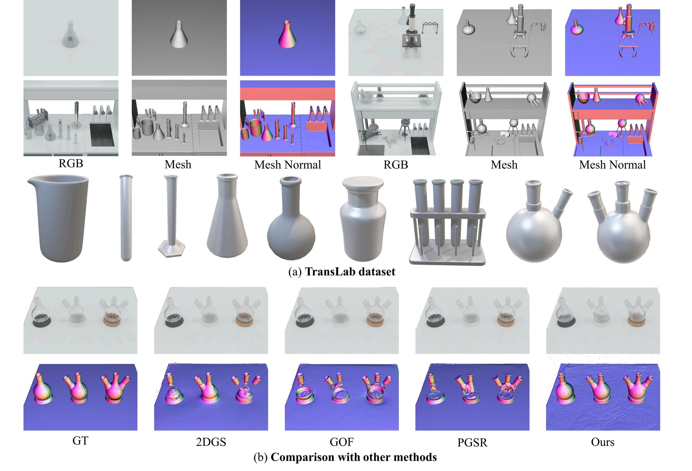
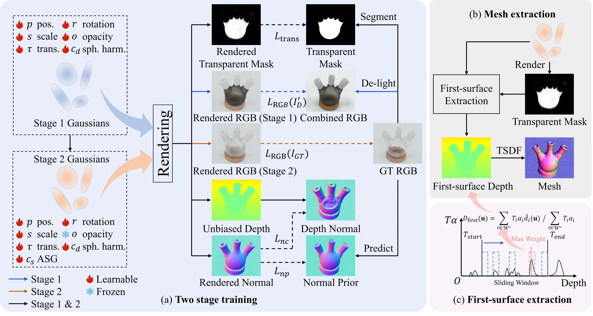

# TSGS: Improving Gaussian Splatting for Transparent Surface Reconstruction via Normal and De-lighting Priors

[](https://arxiv.org/abs/2504.12799)
[](https://longxiang-ai.github.io/TSGS/)
[](https://github.com/longxiang-ai/TSGS)
[](https://drive.google.com/file/d/1ATRQdFaxo2XfcBWkk-Etu5IC9CQxeoyU/view?usp=sharing)
[](https://huggingface.co/datasets/Longxiang-ai/TransLab)

Official code release for the paper: **TSGS: Improving Gaussian Splatting for Transparent Surface Reconstruction via Normal and De-lighting Priors**.

[Mingwei Li<sup>1,2</sup>](https://github.com/longxiang-ai), [Pu Pang<sup>3,2</sup>](https://github.com/fankewen), [Hehe Fan<sup>1</sup>](https://hehefan.github.io/), [Hua Huang<sup>4</sup>](https://ai.bnu.edu.cn/xygk/szdw/zgj/194482e0996d4044806ac39019896e9c.htm), [Yi Yang<sup>1,&#9993;</sup>](https://scholar.google.com/citations?user=RMSuNFwAAAAJ&hl=en)

*<sup>1</sup>Zhejiang University, <sup>2</sup>Zhongguancun Academy, Beijing, <sup>3</sup>Xi'an Jiaotong University, <sup>4</sup>Beijing Normal University*

## News

* **[2026-03-19]**: v1.3 released! — Fix critical K-matrix scaling bug for DTU at resolution > 1, enhance DTU pipeline with full CLI control. With [Lotus-2](https://github.com/EnVision-Research/Lotus-2) normal priors + ASG, mean CD on DTU improves from 0.511 (paper) to **0.507**.
* **[2026-03-14]**: v1.2 released — Support [TransNormal](https://github.com/longxiang-ai/TransNormal) as an alternative normal prior via `--normal_folder`, achieving improved geometric reconstruction (avg CD 1.68 vs 1.85).
* **[2026-03-14]**: v1.1 released — Optimized hyperparameters, parameterized CUDA rasterizer thresholds, fixed rendering pipeline (AppModel/SpecularModel loading), and configurable random seed.
* **[2025-07-13]**: 🎉 Our code and dataset are released!
* **[2025-07-05]**: 🏆 Our paper has been accepted by ACM MM 2025!
* **[2025-04-18]**: 🎉 Our arXiv paper is released! You can find it [here](https://arxiv.org/abs/2504.12799). Project page is also live!


*We present TSGS, a framework for high-fidelity transparent surface reconstruction from multi-views. (a) We introduce TransLab, a novel dataset for evaluating transparent object reconstruction. (b) Comparative results on TransLab demonstrate the superior capability of TSGS.*

## Method Overview


*(a) The two-stage training process. Stage 1 optimizes 3D Gaussians using geometric priors and de-lighted inputs. Stage 2 refines appearance while fixing opacity. (b) Inference extracts the first-surface depth map for mesh reconstruction. (c) The first-surface depth extraction module uses a sliding window for robust depth calculation.*

## Installation

1. **Clone the repository and setup environment:**

    ```bash
    git clone https://github.com/longxiang-ai/TSGS.git
    cd TSGS
    conda create -n tsgs python=3.8 -y  # Tested with Python 3.8, other versions may also work
    conda activate tsgs
    ```

2. **Install dependencies:**
    Install PyTorch matching your CUDA version (see [PyTorch website](https://pytorch.org/get-started/locally/) for the correct command). We have tested with Python 3.8 and CUDA 11.8, but other corresponding PyTorch-CUDA versions should also work. Example for CUDA 11.8:

    ```bash
    pip install torch torchvision torchaudio --index-url https://download.pytorch.org/whl/cu118
    # Install other requirements and submodules
    pip install -r requirements.txt
    pip install submodules/diff-first-surface-rasterization
    pip install submodules/simple-knn
    ```

3. **Install StableNormal (for input preprocessing):**
    If you need to generate normal and de-lighting maps as input priors, install the StableNormal repository:

    ```bash
    git clone https://github.com/Stable-X/StableNormal.git
    cd StableNormal
    pip install -r requirements.txt
    python preprocess/process_normal.py --source_path /path/to/your/data # For our provided TransLab dataset, you can skip this step because the normal and de-lighting maps are already provided.
    cd .. # Return to the TSGS directory
    ```

4. **(Optional) Install TransNormal (alternative normal prior, v1.2):**
    [TransNormal](https://github.com/longxiang-ai/TransNormal) can be used as an alternative normal estimation model, which yields improved geometric reconstruction quality.

    ```bash
    git clone https://github.com/longxiang-ai/TransNormal.git
    # Follow TransNormal's README to download model weights
    # Generate normal maps for all scenes:
    python preprocess/process_transnormal.py --all --data_root data/translab \
        --transnormal_root /path/to/TransNormal
    # Then train with: --normal_folder transnormals
    ```

## Datasets

### TransLab Dataset

We introduce **TransLab**, a novel dataset specifically designed for evaluating transparent object reconstruction in laboratory settings. It features 8 diverse, high-resolution 360° scenes with challenging transparent glassware. Details of collecting the dataset can be found in [Translab](./translab/README.md).

**Download options:**

- **HuggingFace (recommended):** [](https://huggingface.co/datasets/Longxiang-ai/TransLab)

    ```bash
    # Install huggingface_hub if needed: pip install huggingface_hub
    huggingface-cli download Longxiang-ai/TransLab --repo-type dataset --local-dir data/translab
    ```

- **Google Drive:** [Download link](https://drive.google.com/file/d/1ATRQdFaxo2XfcBWkk-Etu5IC9CQxeoyU/view?usp=sharing)

Please put downloaded data in the `data` folder, and the structure should be like this:

```bash
data/
├── translab/
│   ├── scene_01/
│   │   ├── images/ # original images RGB channel, mask as A channel
│   │   ├── masks/ # Rendered by Blender
│   │   ├── normals/ # obtained by StableNormal
│   │   ├── transnormals/ # (optional) obtained by TransNormal (v1.2)
│   │   ├── delights/ # obtained by StableDelight
│   │   ├── sparse/ # obtained by colmap
│   │   ├── meshes/  # exported from blender, for mesh evaluation
│   │   └── transparent_masks/ # rendered by Blender
│   ├── scene_02/
│   ├── ...
│   └── scene_08/
├── dtu_dataset/
```

### DTU Dataset

We follow the same data preparation process as [PGSR](https://zju3dv.github.io/pgsr/) to prepare the DTU dataset.

Put dtu data in the `data` folder, and the structure should be like this:

```bash
data/
├── dtu_dataset/
│   ├── dtu/
│   │   ├── scan24/
│   │   ├── ...
│   ├── dtu_eval/
│   │   ├── ObsMask/
│   │   ├── Points
```

## Training & Evaluation

The following scripts will first train each scene in the dataset, and then evaluate the results.

```bash
sh run_translab.sh # run on TransLab dataset
sh run_dtu.sh # run on DTU dataset
```

**v1.2 (TransNormal prior):**

```bash
# First generate TransNormal normal maps (see Installation step 4)
# Then train with the alternative normal folder:
python scripts/run_translab.py --normal -d --eval --out_name tsgs_transnormal \
    --normal_folder transnormals --seed 7
```

**v1.3 (DTU with Lotus-2 normal prior):**

v1.3 fixes a critical K-matrix scaling bug when using `--resolution 2` on DTU. Normal priors are generated by [Lotus-2](https://github.com/EnVision-Research/Lotus-2). The full_paper config (Lotus-2 normals + ASG + SD guidance) is now the default for `run_dtu.sh`.

```bash
# 1. Generate Lotus-2 normal maps for all DTU scans
python scripts/generate_dtu_normals.py --scan_id 24 --gpu_id 0  # repeat for each scan

# 2. Run DTU (all params already set as defaults)
sh run_dtu.sh
```

## Results on TransLab

### Image Quality Metrics (PSNR↑ / SSIM↑ / LPIPS↓)

| Scene | Paper (PSNR) | Paper (SSIM) | Paper (LPIPS) | v1.1 (PSNR) | v1.1 (SSIM) | v1.1 (LPIPS) | v1.2 (PSNR) | v1.2 (SSIM) | v1.2 (LPIPS) |
|:---:|:---:|:---:|:---:|:---:|:---:|:---:|:---:|:---:|:---:|
| scene_01 | 41.02 | 0.9960 | 0.0100 | **41.38** | 0.9959 | **0.0093** | 41.05 | 0.9958 | **0.0095** |
| scene_02 | 36.58 | 0.9800 | 0.0380 | **36.64** | **0.9806** | 0.0380 | **36.60** | **0.9803** | 0.0387 |
| scene_03 | 40.34 | 0.9950 | 0.0130 | **40.55** | 0.9948 | 0.0131 | **40.55** | 0.9949 | 0.0131 |
| scene_04 | 38.37 | 0.9920 | 0.0150 | **38.71** | **0.9921** | **0.0141** | **38.69** | **0.9922** | **0.0142** |
| scene_05 | 35.41 | 0.9780 | 0.0320 | 35.40 | 0.9777 | **0.0318** | **35.44** | 0.9778 | **0.0317** |
| scene_06 | 37.37 | 0.9850 | 0.0250 | **37.61** | **0.9856** | **0.0242** | **37.66** | **0.9859** | **0.0237** |
| scene_07 | 45.72 | 0.9970 | 0.0060 | **45.98** | **0.9977** | **0.0059** | **46.16** | **0.9979** | **0.0058** |
| scene_08 | 37.83 | 0.9870 | 0.0190 | **38.23** | **0.9872** | **0.0185** | **38.26** | **0.9873** | **0.0182** |
| **Avg** | 39.08 | 0.9888 | 0.0198 | **39.31** | **0.9889** | **0.0194** | **39.30** | **0.9890** | **0.0194** |

### Geometric Metrics (Chamfer Distance↓ / F1 Score↑)

| Scene | Paper (CD) | Paper (F1) | v1.1 (CD) | v1.1 (F1) | v1.2 (CD) | v1.2 (F1) |
|:---:|:---:|:---:|:---:|:---:|:---:|:---:|
| scene_01 | 1.68 | 0.9700 | **1.67** | 0.9690 | **1.59** | **0.9702** |
| scene_02 | 2.42 | 0.9100 | 2.44 | 0.9041 | **2.14** | **0.9265** |
| scene_03 | 1.57 | 0.9600 | **1.55** | 0.9576 | **1.52** | 0.9556 |
| scene_04 | 1.60 | 0.9500 | **1.59** | **0.9521** | 1.60 | 0.9489 |
| scene_05 | 1.75 | 0.9700 | **1.66** | 0.9671 | **1.60** | **0.9714** |
| scene_06 | 1.54 | 0.9800 | **1.49** | **0.9850** | **1.38** | **0.9851** |
| scene_07 | 2.05 | 0.9600 | **1.90** | **0.9699** | **1.62** | **0.9805** |
| scene_08 | 2.23 | 0.9400 | **2.16** | **0.9452** | **2.03** | **0.9489** |
| **Avg** | 1.86 | 0.9550 | **1.81** | **0.9563** | **1.68** | **0.9609** |

**Key observations:**
- **v1.1** (optimized hyperparameters + StableNormal): Improves over paper baselines in most image quality metrics. Average PSNR improves from 39.08 to 39.31.
- **v1.2** (TransNormal prior): Achieves significant geometric improvement — average Chamfer Distance drops from 1.86 (paper) / 1.81 (v1.1) to **1.68**, and F1 score improves from 0.955 to **0.961**, while maintaining comparable image quality.

## Results on DTU

### Geometric Metrics — Chamfer Distance↓ (v1.3)

v1.3 uses [Lotus-2](https://github.com/EnVision-Research/Lotus-2) normal priors + Adaptive Spherical Gaussians (ASG) + Score Distillation Normal Guidance, with a single consistent config across all 15 scans. Key bug fix: K-matrix scaling for `NonCenteredCamera` at resolution > 1.

| Scan | Paper | v1.3 |
|:---:|:---:|:---:|
| 24 | 0.34 | 0.391 |
| 37 | 0.53 | 0.544 |
| 40 | 0.37 | 0.381 |
| 55 | 0.41 | **0.323** |
| 63 | 0.79 | 0.845 |
| 65 | 0.55 | **0.525** |
| 69 | 0.48 | **0.465** |
| 83 | 1.05 | 1.054 |
| 97 | 0.62 | **0.612** |
| 105 | 0.59 | **0.585** |
| 106 | 0.42 | **0.417** |
| 110 | 0.49 | **0.452** |
| 114 | 0.31 | 0.311 |
| 118 | 0.37 | **0.359** |
| 122 | 0.35 | **0.349** |
| **Avg** | **0.511** | **0.507** |

**Key observations:**
- **v1.3** achieves mean CD **0.507**, improving over the paper's **0.511** with a single consistent hyperparameter setting.
- **9/15** scans match or beat the paper's reported values, with notable improvements on scan55 (-0.087), scan110 (-0.038), and scan65 (-0.025).

## TODO

* [x] Release Arxiv paper link.
* [x] Release source code.
* [x] Release TransLab-Synthetic dataset and download link.
* [x] v1.1: Optimized hyperparameters and rendering pipeline fixes.
* [x] v1.2: TransNormal support for improved geometric reconstruction.
* [x] v1.3: Fix K-matrix scaling bug, DTU pipeline with Lotus-2 normals (mean CD 0.507 vs paper 0.511).
* [ ] Release TransLab-Real dataset and download link.
* [ ] Provide detailed installation and usage instructions.

## Acknowledgements

We would like to thank the following open-source projects for their valuable contributions: [PGSR](https://zju3dv.github.io/pgsr/), [StableNormal](https://github.com/Stable-X/StableNormal), [TransNormal](https://github.com/longxiang-ai/TransNormal), [Lotus-2](https://github.com/EnVision-Research/Lotus-2), [2DGS](https://github.com/hbb1/2d-gaussian-splatting), and [GroundedSAM](https://github.com/IDEA-Research/Grounded-Segment-Anything).

We also thank [Nerfies](https://github.com/nerfies/nerfies.github.io) for their amazing website template.

## Star History

[](https://www.star-history.com/#longxiang-ai/TSGS&Date)

## Citation

If you find our work useful, please consider citing:

```bibtex
@misc{li2025tsgs,
  title={TSGS: Improving Gaussian Splatting for Transparent Surface Reconstruction via Normal and De-lighting Priors}, 
  author={Mingwei Li and Pu Pang and Hehe Fan and Hua Huang and Yi Yang},
  year={2025},
  eprint={2504.12799},
  archivePrefix={arXiv},
  primaryClass={cs.CV},
  url={https://arxiv.org/abs/2504.12799}, 
}
```
